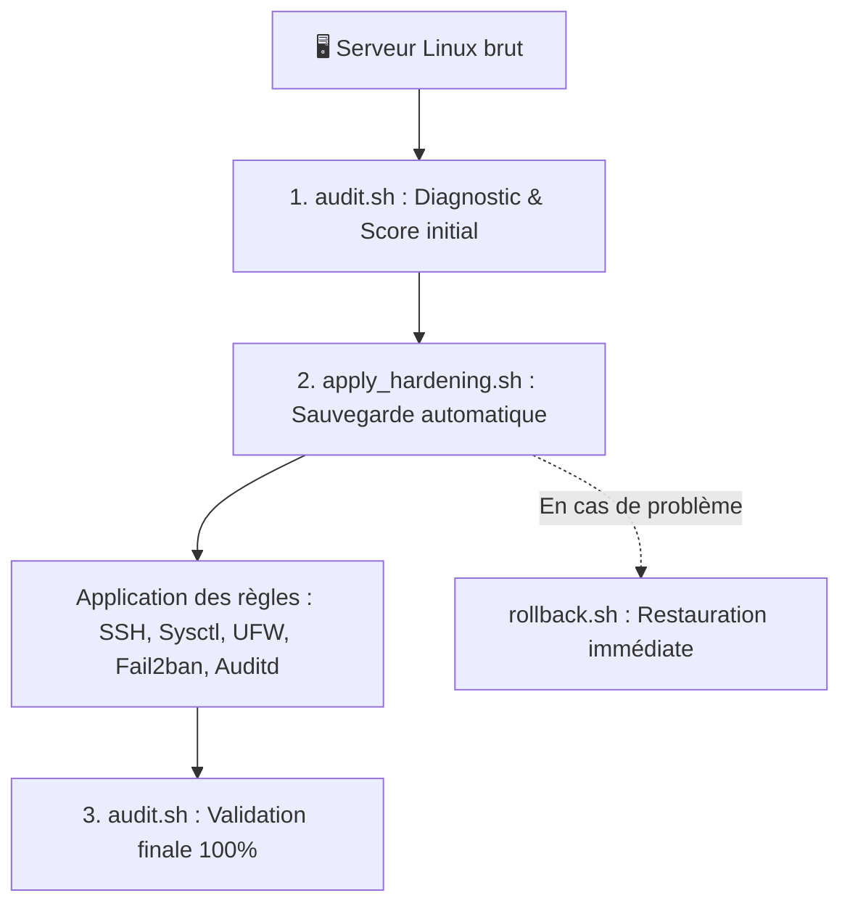

# 🛡️ AutoSec-Hardener : Framework de Durcissement & d'Audit de Sécurité

> **Boîte à outils opérationnelle d'audit et de sécurisation automatisée pour serveurs Linux (Debian / Ubuntu).**  
> Aligné sur les recommandations de l'**ANSSI** et les **CIS Benchmarks**.

---

## 📌 1. Présentation du Projet

### Le Constat
Par défaut, une installation classique d'un serveur Linux comporte plusieurs faiblesses exploitables :
* Connexion directe avec le compte `root` ou par mot de passe simple (vulnérable au brute-force).
* Paramètres réseau et noyau permissifs par défaut (vulnérable au *SYN Flood DoS*, à l'usurpation d'adresses *IP Spoofing*, et aux redirections *ICMP MitM*).
* Absence de pare-feu actif par défaut et manque de traçabilité des modifications sur les fichiers sensibles (`/etc/passwd`, `/etc/shadow`, `/etc/sudoers`).

### La Solution
**AutoSec-Hardener** automatise l'évaluation de conformité et le durcissement du serveur en un cycle sécurisé :
1. **Audit initial non destructif** avec calcul d'un score de sécurité sur 100%.
2. **Sauvegarde automatique** préalable des fichiers de configuration dans `/var/backups/`.
3. **Application des règles de durcissement** (SSH, noyau, pare-feu, IDS, traçabilité).
4. **Plan de retour arrière (Rollback)** immédiat en cas d'imprévu.

---

## 🏗️ 2. Architecture & Cycle de Fonctionnement



---

## 🛡️ 3. Matrice des Protections Appliquées (Les 5 Piliers)

| Pilier | Configuration cible | Risque bloqué |
| :--- | :--- | :--- |
| **🔑 Accès SSH** | Clés publiques uniquement (`Ed25519/RSA4096`), `PermitRootLogin no`, `PasswordAuthentication no`, Ciphers forts | Vol d'identifiants, attaques par dictionnaire, interception de session |
| **🌐 Réseau & Noyau (sysctl)** | `tcp_syncookies = 1`, `rp_filter = 1`, `accept_redirects = 0`, `randomize_va_space = 2` (ASLR) | Déni de service (SYN Flood), IP Spoofing, Man-in-the-Middle, Buffer Overflows |
| **🧱 Pare-feu (UFW)** | Politique par défaut `DROP` (entrant bloqué), port SSH autorisé | Exposition de ports et services non sollicités |
| **🚫 Détection active (Fail2ban)** | Détection des échecs d'authentification, ban IP automatique après 3 échecs pendant 24h | Attaques automatisées par force brute |
| **👁️ Traçabilité (Auditd)** | Surveillance en temps réel des accès/écritures sur `/etc/passwd`, `/etc/shadow`, `/etc/sudoers` | Altération furtive du système et élévation de privilèges |
| **🔄 Maintenance** | Mises à jour de sécurité automatiques (`unattended-upgrades`) | Failles zero-day et CVEs non corrigées |

---

## 📁 4. Arborescence du Dépôt

```
autosec-hardening/
├── configs/
│   ├── sysctl_security.conf     # Durcissement réseau (Anti-Spoofing, Anti-SYN flood, ASLR)
│   ├── sshd_hardened.conf       # Sécurisation OpenSSH (clés seules, ciphers forts, root désactivé)
│   ├── audit.rules              # Règles Auditd pour la traçabilité des fichiers critiques
│   └── jail.local               # Configuration Fail2ban anti-brute-force
├── audit.sh                     # Script d'audit et calcul du score de conformité
├── apply_hardening.sh           # Déploiement automatique avec sauvegarde préalable
├── rollback.sh                  # Restauration instantanée de la configuration antérieure
├── playbook.yml                 # Version Ansible pour déploiement multi-serveurs
├── inventory.ini                # Inventaire des machines pour Ansible
└── README.md                    # Documentation complète
```

---

## 🧪 5. Guide de Déploiement en Laboratoire Local (HomeLab)

### Prérequis Matériels & Logiciels :
* Un PC hôte avec **VirtualBox** (ou **VMware**).
* L'image ISO d'**Ubuntu Server 24.04 LTS** (ou 22.04 LTS).

### Paramètres de la Machine Virtuelle (VM) :
* **Type :** Linux / Ubuntu (64-bit).
* **Ressources :** 1 ou 2 vCPU, 2048 Mo de RAM (2 Go), 20 Go de disque.
* **Carte Réseau :** Mode **« Accès par pont » (Bridged)** *(la VM aura sa propre IP sur votre réseau local)*.
* **Pendant l'installation d'Ubuntu :** Cochez la case **`Install OpenSSH server`**.

---

## 🚀 6. Procédure d'Utilisation Étape par Étape

### Étape 1 : Connexion à la VM & Récupération du Projet
Depuis le terminal de votre PC hôte :
```bash
# 1. Se connecter en SSH à la VM
ssh utilisateur@<IP_DE_LA_VM>

# 2. Cloner le dépôt
git clone https://github.com/primemarafa/autosec-hardening.git
cd autosec-hardening

# 3. Rendre les scripts exécutables
chmod +x *.sh
```

---

### Étape 2 : Lancer l'Audit Initial (État des lieux)
Évaluez le niveau de sécurité actuel de la machine :
```bash
sudo ./audit.sh
```
*Le script inspecte les 5 piliers et affiche les vulnérabilités détectées ainsi qu'un score global (souvent inférieur à 40% sur une installation par défaut).*

---

### Étape 3 : Appliquer le Durcissement
Appliquez l'ensemble des sécurités en une seule commande :
```bash
sudo ./apply_hardening.sh
```
*Le script va :*
1. Créer une archive de sauvegarde horodatée dans `/var/backups/autosec_hardening_<date>/`.
2. Installer les paquets de sécurité requis (`ufw`, `fail2ban`, `auditd`, etc.).
3. Appliquer les configurations durcies et redémarrer les services en toute sécurité.

---

### Étape 4 : Valider le Nouveau Score de Sécurité
Relancez l'audit pour vérifier la conformité :
```bash
sudo ./audit.sh
```
*Le score passera à **100% (Niveau de sécurité ÉLEVÉ)**.*

---

### Étape 5 (Optionnel) : Tester le Retour Arrière (Rollback)
Pour restaurer la configuration initiale de la machine :
```bash
sudo ./rollback.sh
```

---

## 🤖 7. Déploiement à l'Échelle via Ansible

Si vous disposez d'un parc de serveurs à durcir simultanément :
```bash
# 1. Renseigner les IPs de vos serveurs dans inventory.ini
nano inventory.ini

# 2. Exécuter le playbook
ansible-playbook -i inventory.ini playbook.yml -k -K
```

---

## 👤 Auteur & Licence
* **Auteur :** Moustapha Marafa ([@primemarafa](https://github.com/primemarafa))
* **Spécialité :** Administration Système, Réseau et Sécurité
* **Licence :** MIT
